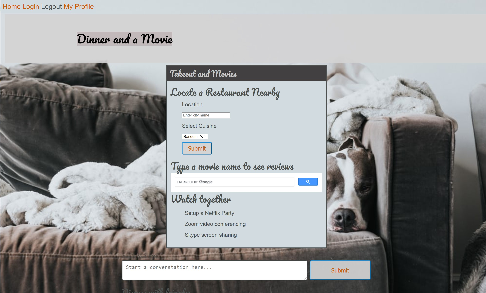

# Dinner and a Movie

Node.js website where users can search for a restaurant nearby and also a movie to watch, and chat about their choices online.

## GitHub URL

https://github.com/DHernandez24e/dinner-and-a-movie

## React Website in Heroku

https://easy-dinner-movie.herokuapp.com/  

## Walkthrough of the application

https://drive.google.com/file/d/1qauqWsFApvmEOZeChU05GsvG6AdCOI1o/view

## Table of Contents

* [Description](#description)
* [Technology](#technology)
* [Installations](#installations)
* [Usage](#usage)
* [Testing](#testing)
* [Contribution](#contribution)
* [React](#react)

## Description

- The website was built using the MERN stack - MongoDB, ExpressJS, ReactJS, NodeJS, npm packages and query languages from GraphQL and Apollo server.

- Core skills and technologies leveraged in the creation of this site, include

    * NoSQL databases - MongoDB and Mongoose ODB
    * React single-page applications - React, Apollo Provider        
    * GraphQL APIs and Apollo server\client
    * Third party APIs - Yelp and Netflix
    * Concurrent servers in a MERN app 	Client\server - npm concurrently
    * Authentication - JSON Web Tokens

## Technology

Node.js, JavaScript, ES6, npm MongoDB, Mongoose, Express.js, React.js, GraphQL, GraphQL Playground, Apollo Server, Apollo-Client, graphql-tag, apollo-server-express, apollo-boost, React Router, react-router-dom, apollo/react-hooks, if-env, concurrently, jsonwebtoken, jwt-decode, faker, nodemon, bcrypt

## Installations

- Prereq: install VSCode, Node.js, and MongoDB
- After cloning the GitHub repo to your local drive, run the following in the VSCode command-line terminal
- Install all components listed within the package.json file for npm, from the root
     - $ `npm i`

- For further installations if needed, you may choose to install from the client or server as well.
    - Server 
    - $ `cd server`
    - $ `npm i`
     - Client
    - $ `cd client`
    - $ `npm i`

## Usage

### Website
- The website has been deployed to a Heroku app containing an mLab MongoDB add on, to deploy to a production-like environment.
- https://easy-dinner-movie.herokuapp.com/ 

-	

### Local install, seed and usage 

#### Localhost deployment

- If cloned to your localhost, after the installations, to start the Node.js application run from the root in bash, which will start both the client and server side applications.

   - $ `npm start`

#### Server directory - GraphQL server API

- Steps completed prior to the deployment:

- To view the site locally on the development server, first install the npm packages
    - $ `npm i` or `npm install`
- Start the MongoDB
    - $ `mongod`
- To test the Apollo server sider connections to the Express.js, (to test the schemas and server.js), run the following 
    - $ `cd server`
    - $ `npm run watch`
- Use GraphQL Playground server environment, view locally at 
- $ `http://localhost:3001/graphql`

#### Client directory - React front-end development server
- If cloning to your local drive, install the npm packages 
    - $ `cd client`
    - $ `npm i` or `npm install`
- Then start up the app. The React app client starts up by running from the client directory
    - $ `cd client`
    - $ `npm start`
- The default browser in your React environment, 
    - `http://localhost:3000/`

## Testing

- The development server will then run under the /server directory, React development under the /client directory. To test for the client, run both servers, cd to each directory, then enter `npm start` in two separate bash windows.

- There are two servers running through localhost,  on two different ports,

## Contribution

Asa Katarina Thisner, Diego Hernandez, Katherine Guerin, Chris Acedo

## React

This project was bootstrapped with [Create React App](https://github.com/facebook/create-react-app).

## Available Scripts

In the project directory, you can run:

### `npm start`

Runs the app in the development mode. 
Open [http://localhost:3000](http://localhost:3000) to view it in the browser.

The page will reload if you make edits. 
You will also see any lint errors in the console.

### `npm test`

Launches the test runner in the interactive watch mode. 
See the section about [running tests](https://facebook.github.io/create-react-app/docs/running-tests) for more information.

### `npm run build`

Builds the app for production to the `build` folder. 
It correctly bundles React in production mode and optimizes the build for the best performance.

The build is minified and the filenames include the hashes. 
Your app is ready to be deployed!

See the section about [deployment](https://facebook.github.io/create-react-app/docs/deployment) for more information.

### `npm run eject`

**Note: this is a one-way operation. Once you `eject`, you can’t go back!**

If you aren’t satisfied with the build tool and configuration choices, you can `eject` at any time. This command will remove the single build dependency from your project.

Instead, it will copy all the configuration files and the transitive dependencies (webpack, Babel, ESLint, etc) right into your project so you have full control over them. All of the commands except `eject` will still work, but they will point to the copied scripts so you can tweak them. At this point you’re on your own.

You don’t have to ever use `eject`. The curated feature set is suitable for small and middle deployments, and you shouldn’t feel obligated to use this feature. However we understand that this tool wouldn’t be useful if you couldn’t customize it when you are ready for it.

## Learn More

You can learn more in the [Create React App documentation](https://facebook.github.io/create-react-app/docs/getting-started).

To learn React, check out the [React documentation](https://reactjs.org/).

### Code Splitting

This section has moved here: https://facebook.github.io/create-react-app/docs/code-splitting

### Analyzing the Bundle Size

This section has moved here: https://facebook.github.io/create-react-app/docs/analyzing-the-bundle-size

### Making a Progressive Web App

This section has moved here: https://facebook.github.io/create-react-app/docs/making-a-progressive-web-app

### Advanced Configuration

This section has moved here: https://facebook.github.io/create-react-app/docs/advanced-configuration

### Deployment

This section has moved here: https://facebook.github.io/create-react-app/docs/deployment

### `npm run build` fails to minify

This section has moved here: https://facebook.github.io/create-react-app/docs/troubleshooting#npm-run-build-fails-to-minify
